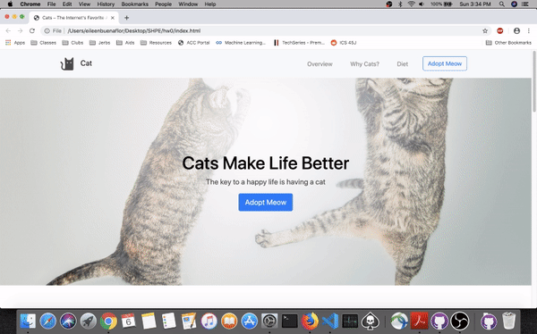

# Unit 0 - First Cat Website

First Cat Website is a web app that was posted by Make School to help beginners learn to use Bootstrap, HTML, and CSS.

Submitted by: Eileen Buenaflor

Time spent: 2 hours spent in total

## User Stories

The following **required** functionality is complete:

* [X] Website is dynamic. It can be viewed finely with all mobile devices
* [X] Images are dynamic. They change size accordingly.
* [X] Impleted hamburger menu when switched to mobile view

<!-- The following **optional** features are implemented:
* [ ] Added 
* [ ] UI animations
* [ ] Remembering the bill amount across app restarts (if <10mins)
* [ ] Using locale-specific currency and currency thousands separators.
* [ ] Making sure the keyboard is always visible and the bill amount is always the first responder. This way the user doesn't have to tap anywhere to use this app. Just launch the app and start typing. -->

The following **additional** features are implemented:

- [ ] List anything else that you can get done to improve the app functionality (i.e. added ability to remember users when logging out)

## Video Walkthrough 

Here's a walkthrough of implemented user stories:

GIF created with [EzGif](https://ezgif.com/video-to-gif).

## Notes

Not many difficulties or challenges to note.

## License

    Copyright [yyyy] [name of copyright owner]

    Licensed under the Apache License, Version 2.0 (the "License");
    you may not use this file except in compliance with the License.
    You may obtain a copy of the License at

        http://www.apache.org/licenses/LICENSE-2.0

    Unless required by applicable law or agreed to in writing, software
    distributed under the License is distributed on an "AS IS" BASIS,
    WITHOUT WARRANTIES OR CONDITIONS OF ANY KIND, either express or implied.
    See the License for the specific language governing permissions and
    limitations under the License.
