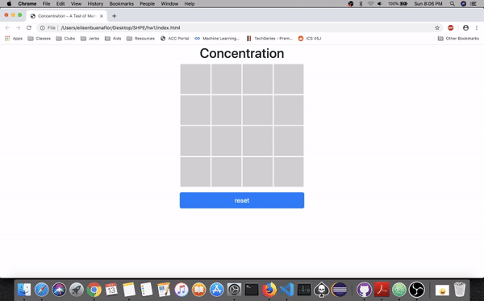

# Unit 1 - Concentration Game

Concentration Game is a tutorial hosted by Make School to help beginners become more familiar with programming in JavaScript, manipulate the DOM using client-side JavaScript
and review HTML/CSS/Bootstrap.

Submitted by: Eileen Buenaflor

Time spent: 2 hours spent in total

## User Stories

The following **required** functionality is complete:

* [X] Board is randomly generated
* [X] Game is functional
* [X] Can reset the game

<!-- The following **optional** features are implemented:
* [ ] Added 
* [ ] UI animations
* [ ] Remembering the bill amount across app restarts (if <10mins)
* [ ] Using locale-specific currency and currency thousands separators.
* [ ] Making sure the keyboard is always visible and the bill amount is always the first responder. This way the user doesn't have to tap anywhere to use this app. Just launch the app and start typing. -->

## Video Walkthrough 

Here's a walkthrough of implemented user stories:

GIF created with [EzGif](https://ezgif.com/video-to-gif).

## Notes

I had a bit of a problem when trying to make the board more grid-like.
Originally it was just all gray, until I realized I needed the "solid" part of "solid red" in board-square border style.

## License

    Copyright [2019] [Eileen Buenaflor]

    Licensed under the Apache License, Version 2.0 (the "License");
    you may not use this file except in compliance with the License.
    You may obtain a copy of the License at

        http://www.apache.org/licenses/LICENSE-2.0

    Unless required by applicable law or agreed to in writing, software
    distributed under the License is distributed on an "AS IS" BASIS,
    WITHOUT WARRANTIES OR CONDITIONS OF ANY KIND, either express or implied.
    See the License for the specific language governing permissions and
    limitations under the License.